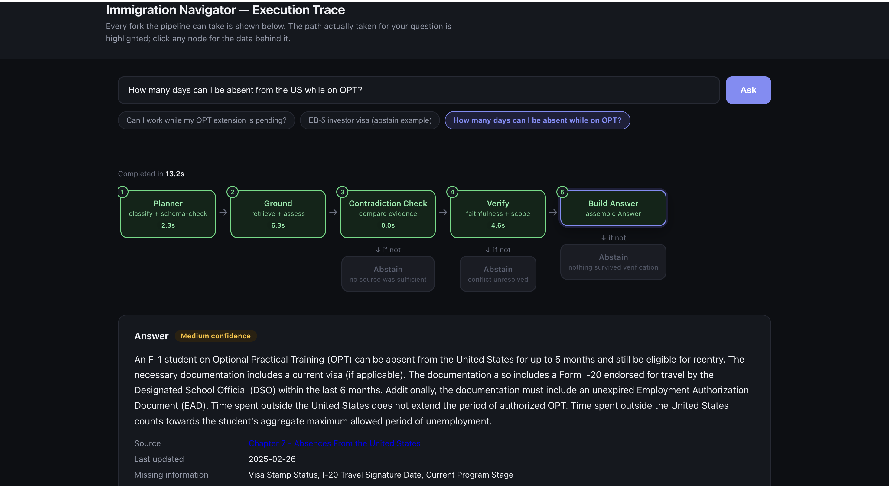
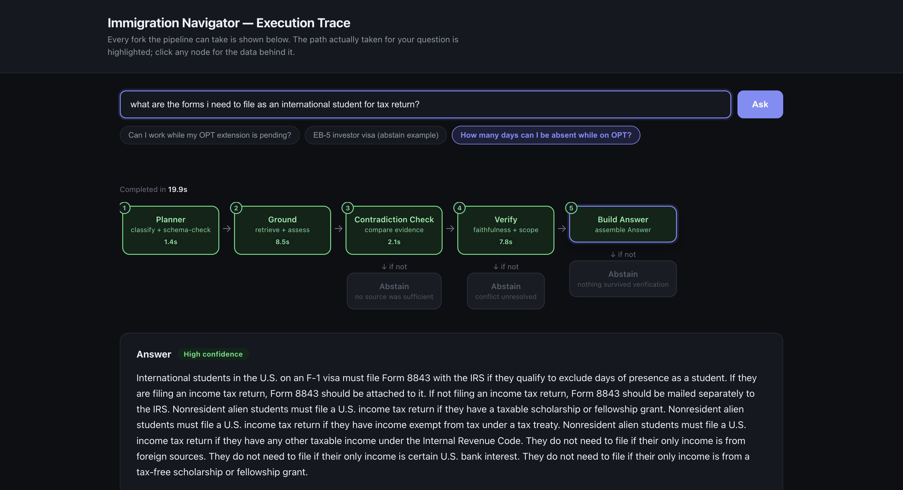
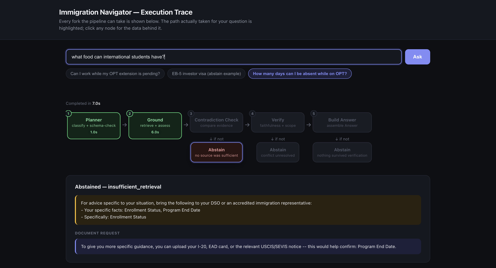

# Immigration Navigator

An AI assistant that answers immigration and tax questions for F-1 international students — grounded in real USCIS, SEVP, and IRS sources, not general LLM knowledge. It states general rules only, never personalized advice, and abstains with a specific reason rather than guessing when it isn't confident.

<p align="center">
  
</p>

## Why

Personalized immigration or tax advice given without authorization is a real legal risk — unauthorized practice of law, or unauthorized tax preparation. So this system is built around a hard boundary: it will always try to answer the *general rule* behind a question ("what's the rule for X"), and it will never tell a specific person what they personally should do. When the corpus genuinely doesn't cover something, or the evidence doesn't hold up, it says so explicitly and routes the user to a DSO, immigration attorney, or tax professional — instead of producing a plausible-sounding wrong answer.

## What it looks like

The `/ui` page renders every question as a clickable flowchart of the actual pipeline execution — not just the final answer, but the real path the question took through it, with every node's underlying data inspectable.

**A real answer, fully grounded and cited:**

<p align="center">
  
</p>

**A correct abstain — no source was sufficient, so it says so instead of guessing:**

<p align="center">
  
</p>

## Architecture

Every question runs through five stages, wired as a LangGraph state machine ([`app/agents/pipeline.py`](app/agents/pipeline.py)):

```
Planner → Ground → Contradiction Check → Verify → Build Answer
             ↓ if not          ↓ if not         ↓ if not
          Abstain           Abstain           Abstain
    (no source sufficient) (conflict unresolved) (nothing survived verification)
```

1. **Planner** ([`planner.py`](app/agents/planner.py)) — classifies the question into 1 of 12 categories (6 immigration, 6 tax) and identifies which required facts are already known vs. missing. Pure classification, no retrieval or generation.

2. **Grounding loop** ([`grounding_loop.py`](app/agents/grounding_loop.py)) — retrieval plus a sufficiency judgment:
   - **Query expansion**: rewrites the question into sharper sub-queries, specifically bridging colloquial-vs-official terminology gaps (e.g. "exemption" → "deduction").
   - **Hybrid search**: every query variant gets both vector search (meaning) and PostgreSQL full-text search (exact terms), merged via Reciprocal Rank Fusion.
   - **LLM re-ranking**: a wide candidate pool gets read and reordered by an LLM for true relevance — skipped automatically when the pool is already small, to save a call.
   - **Chunk-neighbor expansion**: a selected chunk's immediate neighbors get pulled in too, so a passage that starts mid-thought doesn't lose its antecedent context.
   - Immigration (USCIS + SEVP) and tax (IRS) source tiers are queried **concurrently**, with the higher-priority tier winning if it succeeds.

3. **Contradiction Finder** ([`contradiction_finder.py`](app/agents/contradiction_finder.py)) — when 2+ documents are retrieved, checks whether they actually disagree on the *same specific scenario* (not just superficially similar wording), weighing source tier, recency, and document type. A claimed conflict must be backed by a real, verbatim quote or it's discarded. If it can't confidently resolve a genuine conflict, it shows both sources instead of picking one.

4. **Verifier** ([`verifier.py`](app/agents/verifier.py)) — two independent, parallel checks on the draft answer:
   - **Faithfulness**: decomposes the answer into atomic claims, checks each against real retrieved text, drops anything unsupported.
   - **Scope gate**: screens for any sentence that crossed from general rule into personalized advice, drops it.

5. **Build answer or abstain** — surviving claims are assembled into a final answer with a confidence level, every distinct cited source as a clickable link, and missing-info notes. Abstains come with one of three specific reasons — never a generic failure.

## Data

- **Corpus**: USCIS Policy Manual (students/exchange visitors + adjudications volumes), every SEVP Study in the States student page, and 72 IRS pages/forms/publications relevant to nonresident-alien student tax topics — 3,183 chunks total.
- **Ingestion** ([`ingest.py`](app/retrieval/ingest.py), [`scraper.py`](app/retrieval/scraper.py)): real scraping (via `curl_cffi` to get past USCIS's TLS-fingerprint bot detection), chunked with overlap and a contextual title prefix, embedded with OpenAI `text-embedding-3-small`, stored in Postgres + pgvector.
- No automatic freshness refresh — the corpus updates only when ingestion is re-run manually.

## Running it

```bash
docker-compose up -d          # Postgres + pgvector
cp .env.example .env          # add your OPENAI_API_KEY
pip install -r requirements.txt
python -m app.retrieval.ingest    # populate the corpus (one-time)
uvicorn app.api.main:app --reload
```

Then open `http://127.0.0.1:8000/ui`.

## Testing

Two distinct layers:

- **`pytest tests/`** — 61 automated tests, fully offline (no network, API key, or database required — verified against a fake key and an unreachable DB). Covers scraping/parsing, the planner, verifier, contradiction finder, the grounding loop's tier-preference logic, hybrid search's fusion/re-ranking/neighbor-expansion internals, and the FastAPI/streaming endpoints.
- **`python -m app.eval.run_eval`** — a golden set of real questions run live against the actual pipeline, checking abstain-correctness and load-bearing facts. Built after real bugs kept being caught only by manually retyping a question and noticing something looked wrong.

## Known limitations

- An intra-document contradiction (the same IRS publication yielding different figures across runs) isn't caught — the Contradiction Finder currently only compares *different* documents against each other, never a single document's own separately-retrieved chunks.
- One golden-eval question intermittently abstains when it shouldn't; investigated at length without a clean single root cause.
- Not deployed anywhere — local only. Free-hosting candidates identified: Supabase (Postgres+pgvector) + Fly.io/Render/Cloud Run (chosen over pure serverless functions because response latency can exceed short serverless timeouts).
- No document upload flow yet (the planner's `needs_document` machinery exists and is wired, but there's no actual upload/parse step).
- Scope is F-1/M-1 students only.

## Tech stack

Python · FastAPI · LangGraph · OpenAI (`gpt-4o` / `gpt-4o-mini` / `text-embedding-3-small`) · PostgreSQL + pgvector · BeautifulSoup + `curl_cffi` · pytest
